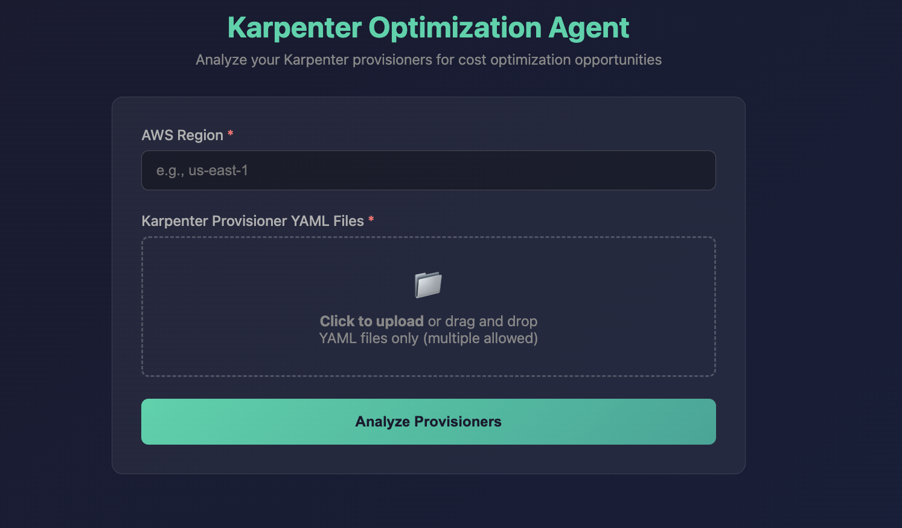
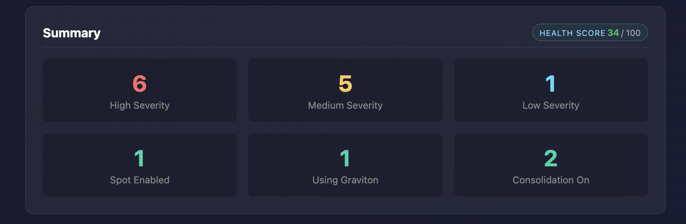
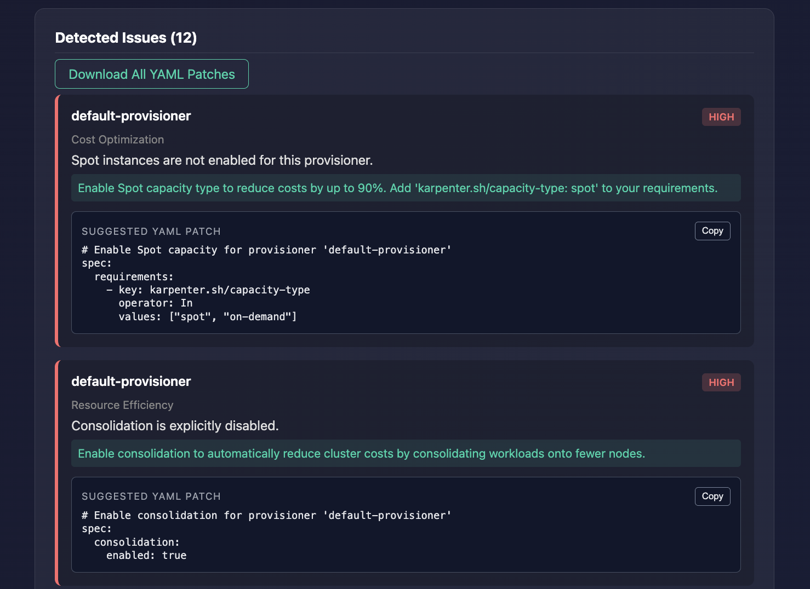
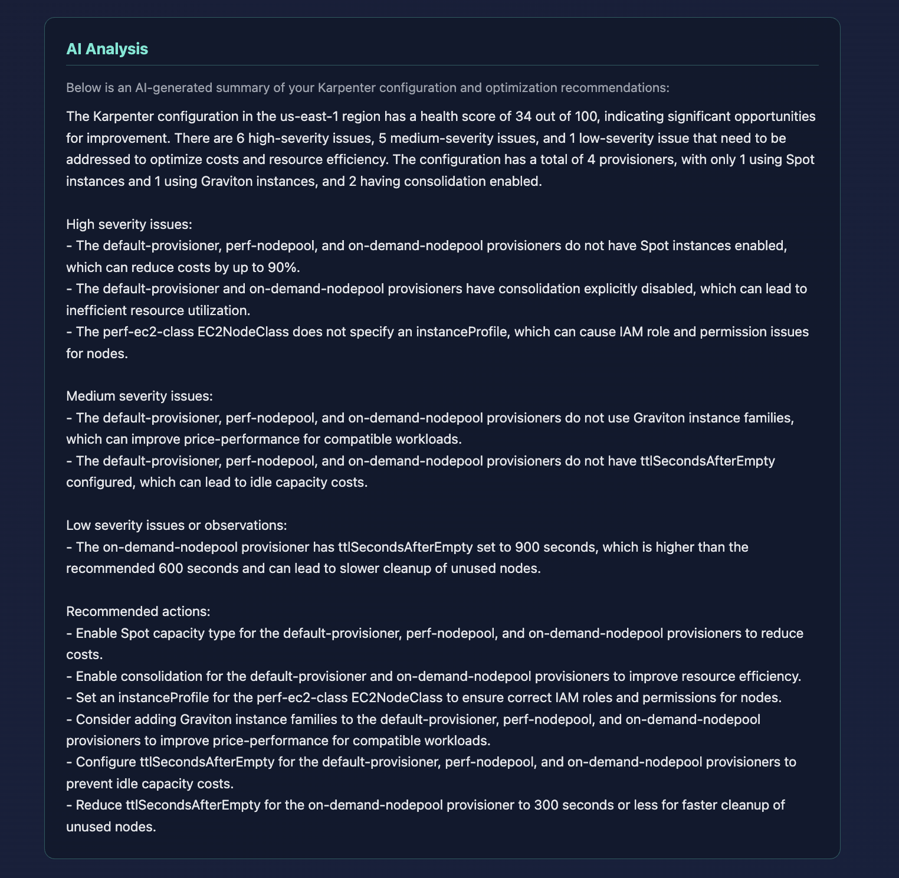

# Karpenter AI Agent


## Overview
Karpenter AI Agent is an open-source analysis and optimization tool for Kubernetes clusters that use Karpenter on AWS. It ingests Provisioner, NodePool, and EC2NodeClass manifests, applies deterministic static rules to detect correctness gaps and efficiency issues, and (optionally) produces an AI-generated natural-language summary strictly based on the rule results. The agent exposes a FastAPI web interface so platform teams can upload YAML, review findings, and download remediation snippets in one place.

All rule logic is deterministic and testable; the analysis flow is parse → analyze → aggregate → report, and AI output is an optional enhancement. The project is released under the MIT License.

## Features
- **Robust YAML parsing** – Handles multi-document uploads, Provisioners, NodePools, and EC2NodeClasses with defensive parsing for edge cases.
- **Deterministic rule engine** – Checks Spot adoption, consolidation configuration, Graviton coverage, `ttlSecondsAfterEmpty`, and EC2NodeClass IAM/subnet/security-group settings.
- **Actionable issue output** – Severity-tagged findings with human-readable recommendations, health score summary, and ready-to-apply YAML patch snippets (copy-to-clipboard in the UI).
- **Optional AI summary** – Groq-backed natural-language synopsis of the deterministic findings; never used for core logic.
- **Grounded explanations (RAG v1)** – Curated Karpenter docs excerpts are retrieved locally to back per-issue explanations and links. No scraping, no bulk doc copying.
- **Modern web UI** – FastAPI + Jinja templates with dark theme, structured cards, and health score visualization.
- **Test coverage + CI** – Pytest fixtures for rules/edge cases plus GitHub Actions that run pytest and pip-audit on every push and pull request.
## Architecture
- Multi-agent design: ParserAgent, CostAgent, ReliabilityAgent, SecurityAgent, and CoordinatorAgent.
- Typed Pydantic contracts for all agent inputs/outputs and normalized config.
- LangGraph orchestration with a deterministic graph.
- Conditional short-circuit when parsing fails (no downstream analysis).
- MCP-style local tools for deterministic, read-only helpers.
- Optional AI summary is generated from rule outputs only; it never affects findings.


## Screenshots

### Upload form


### Summary view


### Issues and patches


### AI analysis


## Installation
```bash
git clone https://github.com/matt-e-builds/karpenter-ai-agent.git
cd karpenter-ai-agent
python3 -m venv .venv
source .venv/bin/activate
pip install -r requirements.txt
```

Optional: enable AI summaries by providing a Groq key.
```bash
export GROQ_API_KEY="your_groq_api_key_here"
```
If the variable is unset, the application still runs; AI summaries are simply disabled.

## Optional RAG-based explanations
The UI can show explanation-only context grounded in a local, curated docs corpus.
This retrieval layer never changes findings or severities; it only adds links and
short narrative context when enabled.

## Running the App
```bash
python main.py
```
Then open http://127.0.0.1:5000 and upload one or more Karpenter YAML files.

## Project Structure
```text
karpenter-ai-agent/
├── docs/knowledge/              # Curated docs corpus for RAG
├── docs/rag.md                  # RAG scope and refresh process
├── docs/rules.md                # Rule IDs, severities, and patch behavior
├── docs/knowledge/karpenter/     # Curated Karpenter knowledge pack (RAG v1)
├── main.py                       # FastAPI entrypoint (routes + UI)
├── src/karpenter_ai_agent/
│   ├── agents/                   # Parser/Cost/Reliability/Security/Coordinator
│   ├── orchestration/            # LangGraph flow + aggregation
│   ├── mcp/                      # Local deterministic tool runtime
│   ├── rag/                      # Local retrieval and explanation helpers
│   └── models/                   # Pydantic contracts
├── parser.py                     # Legacy parser (used by agents)
├── rules.py                      # Legacy rules + scoring (used by agents)
├── models.py                     # Legacy dataclasses (used by UI/compat)
├── llm_client.py                 # Optional Groq integration
├── templates/                    # Jinja2 templates for form/results
├── static/                       # Static assets (CSS/JS)
├── tests/
│   ├── fixtures/                 # Sample Karpenter YAML
│   ├── test_rules.py             # Legacy rule tests
│   ├── test_agents_*.py          # Agent unit tests
│   └── test_orchestration_flow.py
├── requirements.txt
├── pyproject.toml
└── README.md
```

## License
MIT License. See [LICENSE](./LICENSE) for details.

## Maintainer
Maintained by **Matt E.**  
GitHub: https://github.com/matt-e-builds
